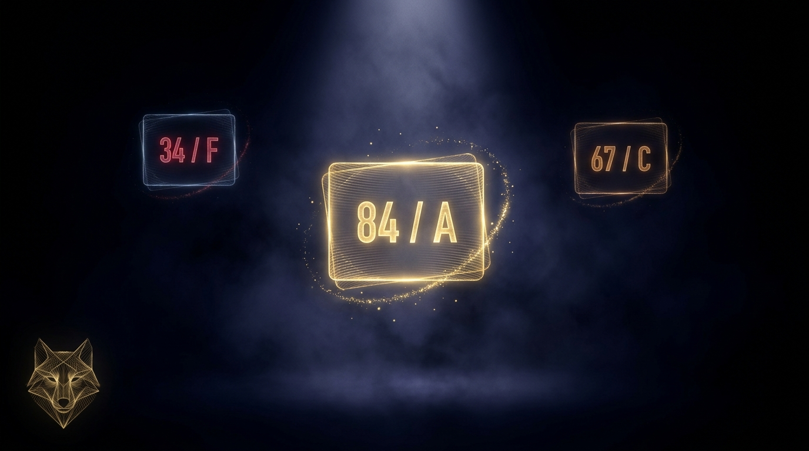

# Dali by Lulu

<p align="center">
  
</p>

**Score your prompt before you spend the credit.**

Most AI generation failures are prompt failures. You can't tell the difference until after you've burned the token. Dali sits inside your agent and fixes that — before you generate.

```
You: "make a cinematic video of a woman walking in tokyo at night"

dali::score_prompt(prompt, "veo3")
→ 34/100  Grade: D
→ Missing: camera movement, lighting description, motion adverb
→ Verdict: High probability of a generic result. Enhance first.

dali::enhance_prompt(prompt, "veo3")
→ Gemini rewrites it using Veo 3's native language:

  "Cinematic. A woman in her 30s walks slowly through neon-lit Shinjuku
   at 3am, rain-wet streets reflecting pink and blue. Slow dolly push
   following behind her, low angle. Breath visible in cold air. Overcast
   amber light above, neon below. Melancholic, atmospheric. No text."

→ Score after: 84/100  Grade: A  ✓ Safe to generate.
```

---

## Install

**Hosted (recommended) — connect once, always-fresh guides, usage history:**

```bash
# Claude Code
claude mcp add dali --url https://dali.getlulu.dev/mcp

# Cursor / Windsurf — add to MCP config:
{
  "mcpServers": {
    "dali": { "url": "https://dali.getlulu.dev/mcp" }
  }
}
```

Login with GitHub at **[dali.getlulu.dev](https://dali.getlulu.dev)** — your history and scores sync automatically.

**Self-hosted — local, no auth:**

```bash
pip install dali-mcp
claude mcp add dali -- python -m dali.server
```

---

## Tools

| Tool | What it does |
|------|-------------|
| `score_prompt(prompt, model)` | Score 0–100 with grade, breakdown, what's missing, verdict |
| `enhance_prompt(prompt, model)` | Gemini rewrites the prompt in the model's native language |
| `analyze_intent(prompt)` | Parse dimensions: camera, motion, lighting, style, mood, gaps |
| `my_story()` | Your scoring history, model stats, grade distribution, insight |
| `list_models()` | All supported models with medium and strength |

---

## Supported models

| Model | Medium | Core strength |
|-------|--------|--------------|
| `veo3` | Video | Cinematic camera language, photorealistic motion |
| `higgsfield` | Video | Physics-driven motion (cloth/hair/fluid), character consistency |
| `kling` | Video | Expressive character motion, facial performance |
| `sora` | Video | Temporal coherence, narrative sequences |
| `midjourney` | Image | Artistic style depth, community-proven patterns |
| `flux` | Image | Technical photography, camera/lens specificity, negative prompts |
| `imagen` | Image | Photorealism, lighting precision, photography brief language |

---

## Why model-specific?

Generic prompt optimizers don't know that Veo 3 needs camera movement more than anything else, that Midjourney ignores sentences and reads comma-separated descriptors, that Flux responds to camera body names like a photographer, that Higgsfield simulates physics so you describe materials in motion not motion abstractly, or that Kling reads expression language and generates facial performance from it.

Dali has a separate scoring model and a separate Gemini enhancement system prompt for each generator — because they speak different languages.

---

## Model guides (MCP resources)

```
creative://guide/veo3         → Camera language + physics
creative://guide/higgsfield   → Motion + character consistency
creative://guide/midjourney   → Keywords + parameters
creative://guide/flux         → Technical photography brief
creative://guide/kling        → Expression + motion amplitude
creative://guide/sora         → Temporal coherence + sequences
creative://guide/imagen       → Photography brief language
creative://models             → All models overview
```

---

## Contributing

Each model guide is in `dali/data/guides/{model}.json`. Found practitioner patterns that consistently work? Open a PR. The data format: prompt + model + quality_rating + notes. Every contribution improves the scorer.

---

MIT License · Built by [Lulu](https://getlulu.dev) · [dali.getlulu.dev](https://dali.getlulu.dev)
