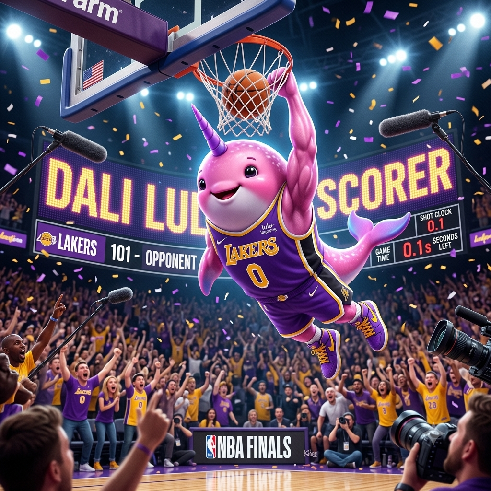

<!-- mcp-name: io.github.Lulu-The-Narwhal/dali -->
# Dali by Lulu

<p align="center">
  
</p>

<p align="center">
  <a href="https://dali.getlulu.dev"><strong>dali.getlulu.dev</strong></a> &nbsp;·&nbsp;
  <a href="https://dali.getlulu.dev/#install">Install</a> &nbsp;·&nbsp;
  <a href="https://dali.getlulu.dev/dashboard">Live stats</a> &nbsp;·&nbsp;
  <a href="https://getlulu.dev">Lulu</a>
</p>

<p align="center">
  <a href="LICENSE"></a>
  <a href="https://www.python.org/downloads/"></a>
  <a href="https://modelcontextprotocol.io"></a>
  <a href="https://dali.getlulu.dev/dashboard"></a>
</p>

---

**The prediction MCP that helps you avoid the AI generation tax.**

Most AI generation failures are prompt failures. You can't tell the difference until after you've burned the token. Dali scores your prompt *before* you generate — so you never waste a credit on a bad prompt again. Every wasted generation has a real cost (a Seedance retry is ~$6) — [the live dashboard](https://dali.getlulu.dev/dashboard) tracks what the community has saved by catching bad prompts before they burned a credit.

```
You: "make a video ad for our glass serum bottle"

dali::score_prompt(prompt, "veo3")
→ 8/100  Grade: F
→ no camera move · no motion · no lighting · 8 words
→ Verdict: Generic stock footage guaranteed. Enhance first.

dali::enhance_prompt(prompt, "veo3")
→ Returns a rewrite brief — YOUR LLM writes the enhanced prompt:

  ① lead with camera — Veo 3's #1 lever: "Slow dolly", "Orbital push"
  ② describe physics: "a drop falls", "liquid ripples", "glass refracts"
  ③ lighting type + quality: "warm backlight", "rim-lit edges"
  ↳ [Camera]. [Subject + motion]. [Lighting]. [Mood]. [No text.]

✦ Claude rewrites using the brief:

  "Slow orbital push around a glass serum bottle on white marble. A single
   amber drop falls in extreme slow motion, catching warm backlight. Macro:
   liquid gold ripples outward from impact. Rim-lit edges, soft studio
   diffusion. Premium, clinical. No text."

dali::score_prompt(enhanced, "veo3")
→ 91/100  Grade: A  ✓ Safe to generate.
```

---

## Contents

- [Install](#install)
- [Tools](#tools)
- [Supported models](#supported-models)
- [Platform supersets](#platform-supersets)
- [Why model-specific?](#why-model-specific)
- [MCP resources](#mcp-resources)
- [Contributing](#contributing)

---

## Install

**Hosted MCP — connect once, scores every prompt:**

```bash
# Claude Code
claude mcp add --transport http dali https://dali.getlulu.dev/mcp
```

```json
// Cursor / Windsurf — .cursor/mcp.json or windsurf settings
{
  "mcpServers": {
    "dali": { "url": "https://dali.getlulu.dev/mcp" }
  }
}
```

→ **[Full install guide with all clients](https://dali.getlulu.dev/#install)**

**Self-hosted — local, no auth required:**

```bash
# PyPI package is not published yet — install directly from source for now
pip install git+https://github.com/Lulu-The-Narwhal/dali-mcp
claude mcp add dali -- python -m dali.server
```

---

## Tools

| Tool | What it does |
|------|-------------|
| `score_prompt(prompt, model)` | Grade 0–100, letter grade, per-dimension breakdown, what's missing, verdict |
| `enhance_prompt(prompt, model)` | Returns a structured rewrite brief — YOUR LLM writes the enhanced prompt using it |
| `analyze_intent(prompt)` | Parse dimensions: camera, motion, lighting, style, mood, gaps |
| `creative_patterns(model)` | Community top patterns for this model from the graph brain |
| `community_benchmark(prompt, model)` | Compare your prompt against community top scorers |
| `my_story()` | Your scoring history, model stats, grade distribution |
| `list_models()` | All supported models with medium and core strength |

---

## Supported models

### Video

| Model | Platforms | Best for | Prompt style |
|-------|-----------|----------|--------------|
| `veo3` | Higgsfield, Google AI Studio (`veo-3.1-generate-preview`), Runway | Cinematic brand films, narrative ads, photorealistic motion | Camera move → Subject → Action → Location → Lighting → Mood |
| `seedance` | Higgsfield, fal.ai (`bytedance/seedance-2.0`) | UGC, social-native content, TikTok/Reels performance ads | Natural language, motion-first, authentic feel |
| `kling` | Higgsfield (`kling3`), Kling.ai (`kling-v3-text-to-video`) | Character animation, product showcases, facial performance | Scene → Characters → Action → Camera → Style; multi-shot labels |
| `runway` | Runway (`gen4_turbo`) | VFX, character performance, cinematic motion | Motion-first — describe what moves, not what exists |
| `wan` | fal.ai (`fal-ai/wan/v2.7/text-to-video`) | 4K, 20-second clips, native audio, open-source workflows | Scene → Motion → Sound → Duration → Mood |
| `minimax` | fal.ai (`fal-ai/minimax/hailuo-02/pro/text-to-video`) | Cinematic storytelling, character animation | Natural language + `[camera movement]` bracket syntax |
| `higgsfield` | Higgsfield (native model) | Physics-driven motion — cloth, hair, fluid, particles | Describe materials in motion, not motion abstractly |

> **Sora 2** (OpenAI): API shutdown September 24, 2026. Do not build new dependencies on it — use Runway or Kling instead.

### Image

| Model | Platforms | Best for | Prompt style |
|-------|-----------|----------|--------------|
| `flux` | BFL API (`flux-pro-v1.1`), fal.ai, Replicate | Photorealism, technical photography, product shots | 30–80 words; camera body + lens specs; front-load subject |
| `midjourney` | Midjourney (v8.1) | Artistic depth, editorial, stylized illustration | Prose + params appended: `--ar 16:9 --s 300 --v 8.1 --style raw` |
| `ideogram` | Ideogram API (`V_4`), fal.ai | Typography, logos, text-in-image, graphic design | Describe text exactly in quotes inside the prompt |
| `firefly` | Adobe Firefly 5 (enterprise) | IP-indemnified commercial assets, 4MP brand content | Natural language + `contentClass` and `style.presets` API params |

> **Imagen 4** (Google): deprecated — use `gemini-3.5-flash` with image output. Dali still scores legacy Imagen prompts via the `imagen` model key but don't build new things on it.

---

## Platform supersets

**Higgsfield** and **Runway** are aggregator platforms — they proxy multiple underlying models under one API. The model you pick matters more than the platform name:

| Platform | Model selector | Underlying model |
|----------|---------------|-----------------|
| Higgsfield | `veo3` | Google Veo 3.1 |
| Higgsfield | `seedance` | ByteDance Seedance 2.0 |
| Higgsfield | `kling3` | Kling 3 |
| Higgsfield | `wan2-7` | Wan 2.7 |
| Higgsfield | `image2video` | Higgsfield native |
| Runway | `veo3` | Google Veo 3.1 |
| Runway | `gen4_turbo` | Runway Gen 4.5 |
| Runway | `seedance` | ByteDance Seedance 2.0 |

Dali scores for the **underlying model's native prompt language**, not the platform wrapper. Pass the model name (`veo3`, `kling`, `seedance`…), not the platform name.

---

## Why model-specific?

Generic prompt optimizers don't know that:
- **Veo 3.1** needs camera movement specified above everything else
- **Kling 3** supports multi-shot scene labels natively in the prompt
- **Flux** responds to camera body and lens names like a photographer (`"Sony A7 IV, 85mm f/1.4"`)
- **Midjourney V8.1** reads prose + parameters, not keyword lists
- **Higgsfield** simulates physics — you describe materials in motion, not motion abstractly
- **Minimax** uses `[Pan left]` bracket syntax for camera moves — plain text camera commands are ignored
- **Ideogram V4** needs text quoted exactly in the prompt for typography accuracy
- **Wan 2.7** generates native audio — include sound descriptions alongside visuals

Dali has a separate scoring rubric and rewrite brief for each model. Your LLM does the creative rewriting — Dali provides the intelligence.

---

## MCP resources

```
creative://guide/veo3       → Veo 3.1 camera language guide
creative://guide/seedance   → Seedance UGC motion guide
creative://guide/kling      → Kling multi-shot + expression guide
creative://guide/runway     → Runway motion-first guide
creative://guide/wan        → Wan 2.7 audio + motion guide
creative://guide/minimax    → Minimax bracket camera guide
creative://guide/higgsfield → Higgsfield physics-motion guide
creative://guide/sora       → Sora 2 guide (API shutdown Sep 24, 2026)
creative://guide/flux       → Flux photography brief guide
creative://guide/midjourney → Midjourney V8.1 + parameters guide
creative://guide/ideogram   → Ideogram V4 typography guide
creative://guide/firefly    → Firefly 5 commercial content guide
creative://guide/imagen     → Imagen 4 guide (deprecated Aug 17, 2026)
creative://models           → All models overview
```

---

## Contributing

Model guides live in `dali/data/guides/{model}.json` on the hosted server. Found practitioner patterns that consistently produce high-grade results? Open an issue with the model, the pattern, and a sample prompt + result. The best contributions come from Reddit, Discord, and YouTube — real practitioners, not official docs.

→ **[Prompt best practices by model](docs/best-practices.md)** — cheat sheets, do/don't tables, top patterns per model
→ **[Dali creative flow skill](skills/dali-creative-flow.md)** — install this skill so your LLM follows the score → enhance → generate workflow automatically

---

[MIT License](LICENSE) · Built by [Lulu](https://getlulu.dev) · [dali.getlulu.dev](https://dali.getlulu.dev)
